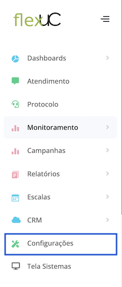
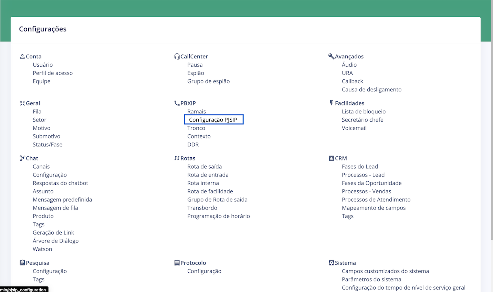
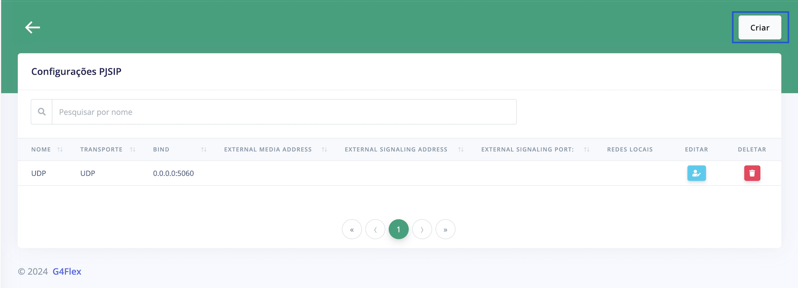
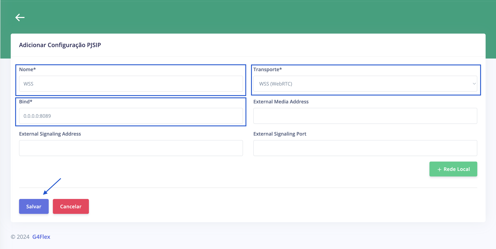
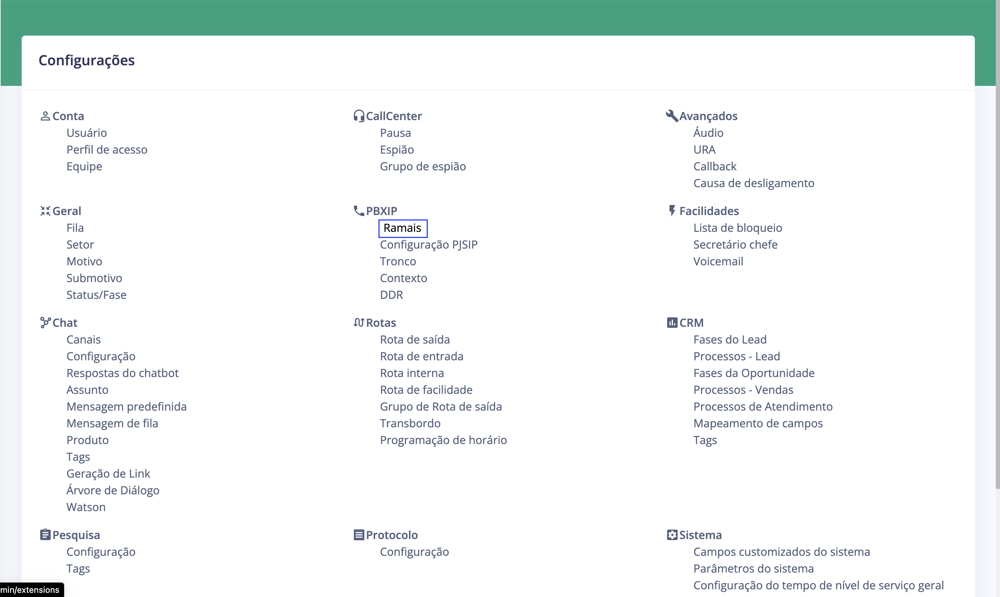
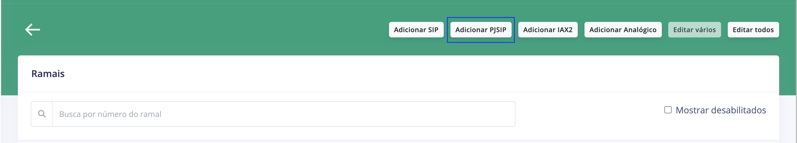
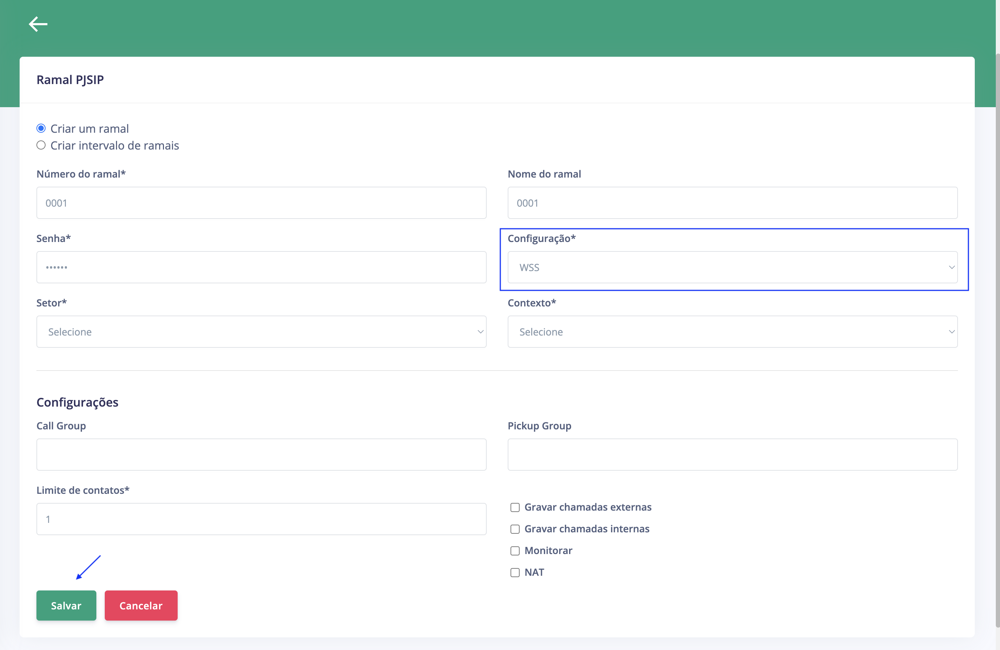

# Configurações no FlexUC

É necessário executar algumas configurações no FlexUC para possibilitar utilizar o Softphone WebRTC:

### 1. Configurar transporte WSS

O Softphone WebRTC não utiliza os transportes UDP e TCP, e sim o WSS (Websocket).

#### Navegue até configurações

#### Clique em "Configuração PJSIP"

#### Clique em "Criar"

#### Preencha os campos e adicione a configuração PJSIP

### 2. Configurar Ramal

É necessário configurar o ramal PJSIP para utilizar o transporte WSS.

#### Navegue até configurações

#### Clique em "Ramais"

#### Clique em "Adicionar PJSIP"

#### Preencha os campos 

Selecione a configuração com transporte WSS, preencha os outros campos do ramal e clique em salvar.

